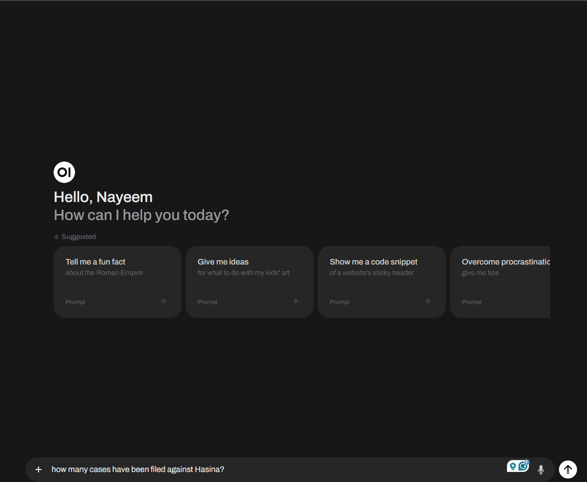

# Fine-tuning-llama3.1_8b

- [x] Data Scraping news article
- [x] Data pre-processing
- [x] Fine tuning LLAMA3.1

### Output in ollama

### HuggingFace repo

- https://huggingface.co/nayeem01/hasina_llama3_8b/tree/main

### NoteBooks Link

- Data processing - https://www.kaggle.com/code/nayeem000/data-pre-processing-for-llama3-1/edit
- Fine tuning llama3.1 - https://www.kaggle.com/code/nayeem000/fine-tuning-llama3-1-unsloth-with-hasina-data/edit

### How run locally with ollama

- wget -P /path/to/directory https://huggingface.co/nayeem01/hasina_llama3_8b/resolve/main/hasina_llama.Q4_K_M.gguf
- ollama create hasina_llama -f ./modelfile
- ollama run hasina_llama
